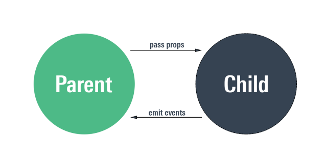
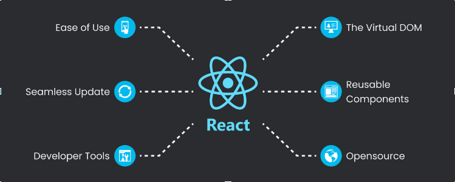

# Introdução ao React

## O que é o React
React é uma biblioteca JavaScript usada para criar interfaces de usuário, ou seja, tudo aquilo que aparece na tela e reage às ações do usuário, como cliques, digitação e navegação.

Ele é focado exclusivamente na camada de visualização (UI) da aplicação.

Tecnicamente, o React é uma biblioteca declarativa baseada em componentes, que cria e gerencia uma árvore de elementos para representar a interface, atualizando a tela de forma eficiente sempre que os dados mudam.


## Para que serve o React
O React serve para construir interfaces de usuário dinâmicas, principalmente quando a tela precisa mudar com frequência de acordo com dados, eventos e interações do usuário.

Ele resolve, principalmente, problemas como:

- Dificuldade de manter a interface sincronizada com os dados
- Código complexo para atualizar partes da tela manualmente
- Baixa organização em aplicações com muitas interações
- Repetição de lógica de criação e atualização de elementos visuais

### Onde o React é mais utilizado

O React é mais utilizado em:

- Aplicações web de médio e grande porte
- Sistemas com muitas interações do usuário
- Interfaces que mudam constantemente sem recarregar a página
- Dashboards, painéis administrativos e sistemas internos
- Produtos que precisam crescer e escalar ao longo do tempo

#### Exemplos:
- Redes sociais
- Plataformas de streaming
- E-commerces
- Sistemas de gestão (ERP, CRM)

## Conceitos-base do React

### 1 - Componentes
Componentes são as unidades fundamentais do React.
Eles representam partes da interface, organizando a UI em blocos independentes, reutilizáveis e isolados.

Cada componente descreve como uma parte da tela deve se comportar e aparecer, podendo ser combinados para formar interfaces maiores.

### 2 - Estado (state)
O estado representa os dados internos de um componente que podem mudar ao longo do tempo.

Quando o estado muda, o React entende que a interface associada a ele precisa ser atualizada, mantendo a UI sincronizada com os dados atuais.

O estado é um dos principais motores da reatividade do React.

### 3 - Propriedades (props)
As props são os parâmetros (ou argumentos) passados para um componente React no momento em que ele é utilizado.

Como um componente React é, na prática, uma função JavaScript, as props funcionam exatamente como os parâmetros de uma função.

As props permitem:

- passar dados de um componente pai para um componente filho
- personalizar componentes reutilizáveis
- tornar componentes configuráveis



### React Element 
Um React Element é um objeto JavaScript que descreve o que deve aparecer na tela.

Não é um componente, não é o HTML real. É apenas uma descrição da interface

**Componentes geram React Elements, e o React usa esses elementos para montar ou atualizar a tela.**

#### Exemplo React Element
```js
const element = <h1>Olá, React</h1>;
```

#### Exemplo React Element sem JSX
```js
const element = React.createElement(
  'h1', //A tag
  null, //Atributos
  'Olá, React' //Valor interno
);

```

#### Um componente criando um React Element
```js
function Titulo() {
  return <h1>Olá, React</h1>;
}
```



## Pontos positivos do React

| Ponto                           | Explicação                                                                                                                                                                           |
| ------------------------------- | ------------------------------------------------------------------------------------------------------------------------------------------------------------------------------------ |
| **Organização do código**       | O React incentiva a divisão da interface em componentes, o que torna o código mais modular, legível e fácil de manter, principalmente em aplicações grandes.                         |
| **Reutilização de componentes** | Componentes podem ser reutilizados em diferentes partes da aplicação, reduzindo duplicação de código e facilitando manutenção e evolução do sistema.                                 |
| **Performance percebida**       | O React atualiza apenas as partes necessárias da interface quando algo muda, evitando recarregar a página inteira e trazendo uma sensação de aplicação mais rápida para o usuário.   |
| **Ecossistema**                 | O React possui uma comunidade enorme, muitas bibliotecas prontas, documentação abundante e grande adoção no mercado, o que facilita aprender, resolver problemas e escalar projetos. |

